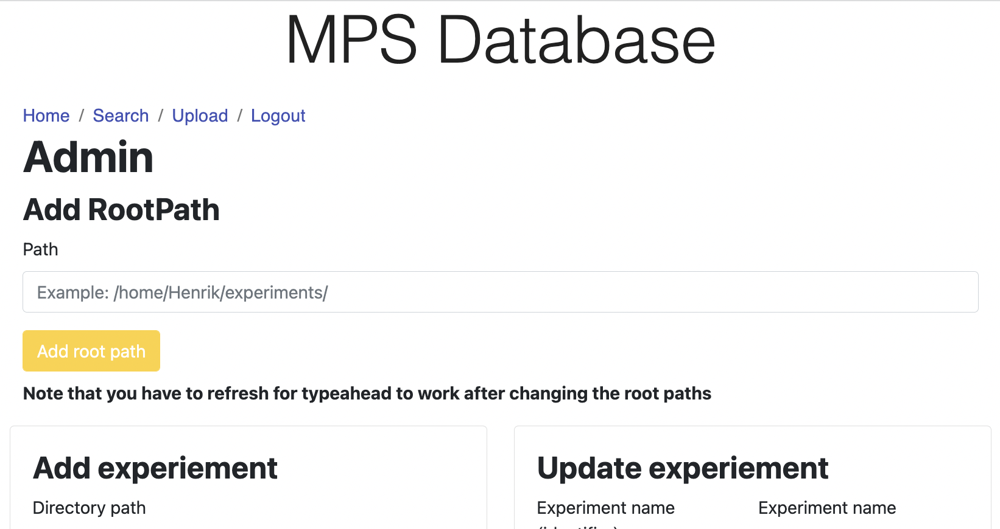
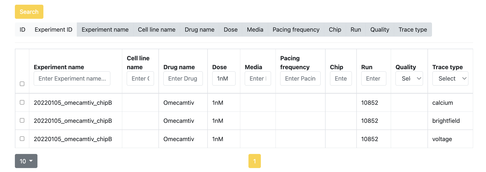
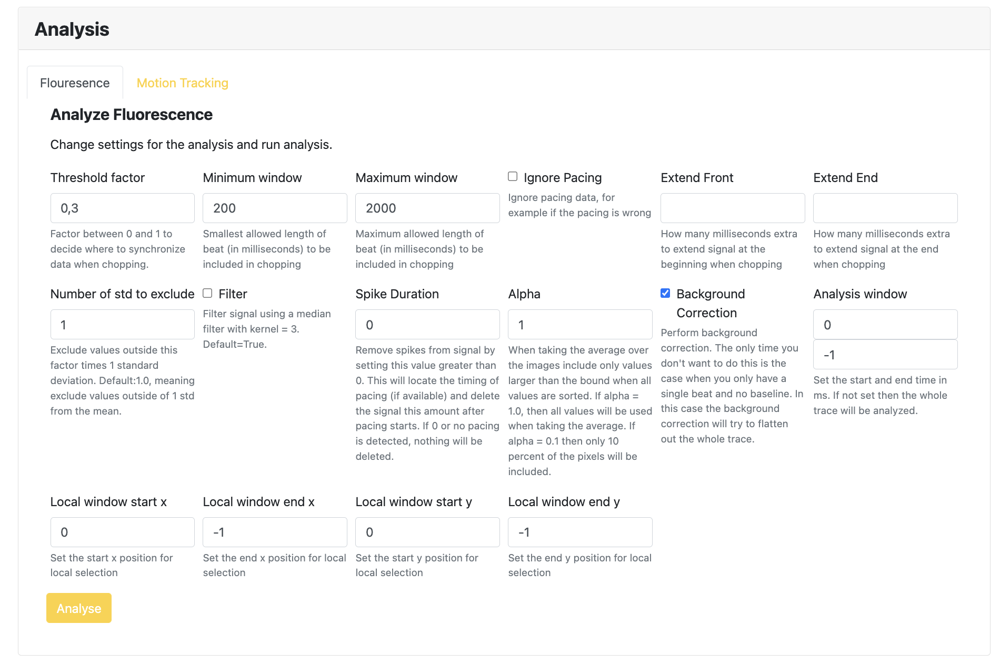
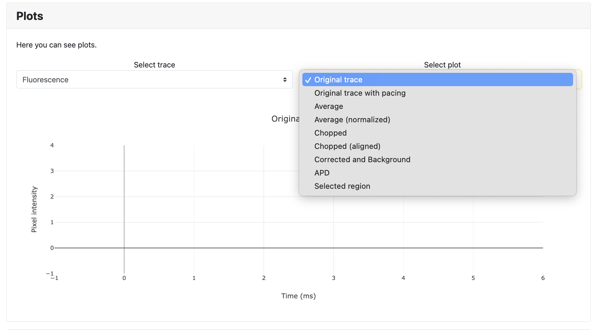

<!-- Global style -->
<style>
section {
  background: #E3E3E3;
}
h1 {
    color: #FF8000;
}
h2 {
    color: #FF8000;
}
</style>

# Introduction to the cardiac MPS database and analysis package

Henrik Finsberg 
Senior Research Engineer
Department of Computational Physiology (Simula)


---

## Plan for this session

- Using the MPS database
    - what is it
    - how to set it up on your laptop
    - how to add data to the database
    - analysis functionality
    - results export
- Unraveling the analysis scripts
    - how to make simple scripts that do the same as the MPS database application

---

## Prerequisites

Software and data
- python version 3.6 or newer
- mps database binary : FIXME: 
- example dataset: FIXME

Skills
- Basic understanding of python programming


---

## Disclaimer

This application is developed by me and used by very few people (Sam / Verena / ?)
If you have suggestions for improving the user experience please let me know :)

---

## What is the MPS database?

* A graphical user interface for analyzing and organizing MPS data

----


## Why do we need this application?

**Examples**
  
* You run an experiment with different chips and different doses of a drug and would like to analyze the data for a drug effect.

* You have data from different experiments with different cell lines and would like to compare the control chips.

* You want to find all experiments using a specific drug / cell line.

* You want to run analysis of EP and mechanics.

---

## Why do we need this application?

* Organization
  > Being able to query the database and find data that meets specific requirements.

* Analysis
  > Being able to easily analyze data across different experiments.

* Simple interface for analysis
  > Having a graphical user interface for performing analysis. 

---

## How to start it?

* Double click on the binary executable
  > Unix users should open the terminal and first make the file executable, e.g
  ```
  chmod +x mps_database_MacOSX
  ```
* This files comes with python bundled inside it so you don't need to install anything to make it work.
* It will take some time to start up
* It will open a small web browser window (Google chrome)
* If this window is not responding you can just open any web browser and go to the url <localhost:8004>

---

## Creating a user and logging in

* You need to create a user in order to use the database
* This is because it was intentionally made for several users
* The application has a authentication layer
* When running this on your laptop the user information will be stored in a local database in your home directory


---

## Home page

- Once you have logged in you will be sent to a very simple home page
- There are two important links here: `Search` and `Upload`


---

## Steps for adding data to the database


---

## Adding some data to the database

I have some data that I want to add to the database for analysis.
Here I am looking the the folder tree inside the folder located at `/Users/finsberg/Dropbox/Simber/data`


---

## Adding root paths

* A root path is a path on your computer containing folders with experiments
* In my case this is `/Users/finsberg/Dropbox/Simber/data`
* You can have multiple root paths
* The app will search for potential experiments in all root paths



---

## Trying to add an invalid path

If you try to add a root path that doesn't exist, you will get an error


---

## Adding the correct path should give a success message


---

## Listing available experiments

- You might need to refresh the page
- Clicking on "Directory path" under "Add experiment" should list all potential experiments


---


## Steps for adding data to the database


---

## We need to provide a config file

- To add an experiment we need to tell the application what is the structure of this experiment
- This is why we add the `.yaml` in the root of the experiment folder


---

## The config file

We need to specify the patterns in the file structure


---

## Special names

There are a few special names that will be mapped to columns in the database table.
Using these names are not required, but it will allow you to more easily find the data you need.
These names are

- dose
- media
- drug
- pacing_frequency
- run
- date
- channel
- cell_line

---

## Organizing your experiments

* Try to make a simple file structure with only one common pattern
* The program will loop through all files in the experiment folder and try to match the patterns
* If you need more that one pattern, the program with start with the first pattern (on the top) and continue until it finds a pattern that match. Note that one file might match several patterns. For example all files in the example folder will match the following pattern `{run}.tif`, so you want to place the most specific pattern on top.
* If one file doesn't match any pattern you will get an error

---

## Excluding folders 

It is also possible to exclude folder from being added to the database.
Say that you have a folder called `failedChips` and `failedChips2`. Then you could write your config file as follows

```
patterns:
- '{dose}_{run}/{date}-{dye}-{drug}_Stream_B01_s1_{channel}-Stream.tif'
excludes:
- 'failedChips'
- 'failedChips2'
```

---

## Adding custom rules

Sometimes the file name doesn't contain the name you want to add to the database. Then you can add custom rules. Here is one real example

```
folder: "190804_Verap_Flec_SCVI20_std"
regexs:
  - "{date}_{dose}_{d1}_{pacing_frequency}/Point{chip}_{media}_{drug_}_Channel{channel}_VC_Seq{seq_nr}.nd2"
  - "{date}_{dose}_{d1}_Dose5_Verap_{pacing_frequency}/Point{chip}_{media}_{drug_}_Channel{channel}_VC_Seq{seq_nr}.nd2"
  - "{date}_{dose}_{pacing_frequency}/Point{chip}_{media}_{drug_}_Channel{channel}_VC_Seq{seq_nr}.nd2"
rules:
  - 'drug_dict = {"Ver": "Verapamil", "Fle": "Flecainide"}; drug = drug_dict[drug_]'

```
These rules as essentially python code that is evaluated (so don't put any dangerous code there)

---

## Lets try to add the experiment

We will get an error message saying that there is no drug called omecamtive in the database


---

## Adding a new drug to the database

* We will add a new drug called `Omecamtiv`
* You should also add a list of synonyms of the drug. This will be names appearing in the filenames
* You can also add info about the drug


---

## Now you should be able to add the experiment


---

## Your turn!

- Try adding the experiment `20211126_bayK_chipB`


---


## Example config file

- Name: `20211126_bayK_chipB.yaml`
- Content
  ```yaml
  patterns:
  - '{dose}_{run}/{date}-{dye}-{drug}_Stream_B01_s1_{channel}-Stream.tif'
  - '{dose}_{run}/{date}-{dye}-{drug}_Stream_B01_s1_{channel}.tif'

  ```
- Need to add BayK drug first

---


## Relationships in the database

- Each colored box represents a table in the database
- Arrows between these boxes indicate relations
- Numbers on arrows indicate type of relation
  > For example an MPSDATA is part of only 1 EXPERIMENT, but 1 EXPERIMENT can contain many (N) MPSDATA


---

## If we go back to the `Search` panel we can search through several items


---

## We can search through drugs

* We can also go back to the `Upload` panel and add info about the drug


---


## We can search through experiments

* Also here it might be relevant to add info about an experiment
* Show example from database at Simula server?


---

## Question to think about

* Currently the info you add about the experiment is a simple text file, but we might want to make some more specific fields for this so that it is easier to search for in the future.
* What type of fields would be relevant?

---


## We can search through the individual video files

* There are several options to filter the search
* I think it is easier to search for the experiment and then filter the results


---

## Filtering the results




---

## Selecting a single file will bring up a new section below the table


---


## Fluorescence analysis section

Here you can specify different options for analyzing the fluorescence 



---

## Motion analysis section

Here you can specify different options for analyzing the motion 


---

## When plotting, you first select the trace and the what kind of plot you want




---

## Exercise - plotting traces

- Select an experiment and plot the traces for voltage for different doses. Make sure to align them at the upstroke and label them by dose.
- Try plotting APDs for each trace.


---

## Heatmaps

You can plot heatmaps of max, min, mean and median values over all time steps for pixel and displacement


---

## Perform local analysis


---

## Look at the movie

- It this is not working then you need to install ffmpeg first.


---

## Export results

- All data is stored in a sqlite file called `mps_database.db` in your home directory which you can open with e.g [DB Browser for SQLite](https://sqlitebrowser.org/dl/)
- You can also export a selection of the data to Excel using the `Export data` button
- Or export all data to a json file using the `Download json data` button.


---

## Overview of the Architecture

* It was built to run on a server
* It connects to a database
* It has a web frontend
* It also has a REST API
* It has been packaged into a single binary that can run on your laptop

